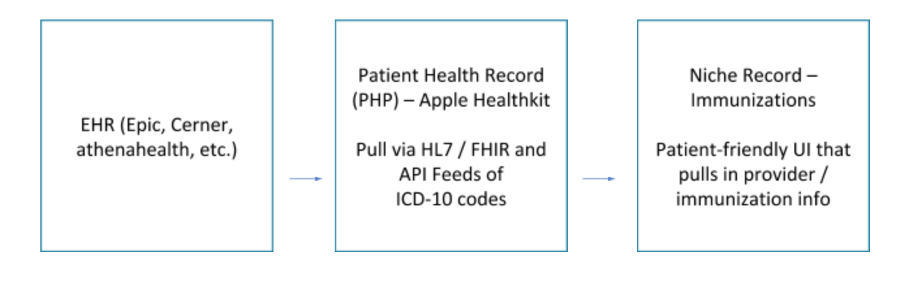
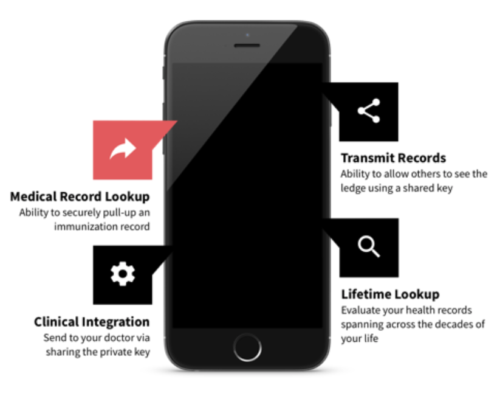
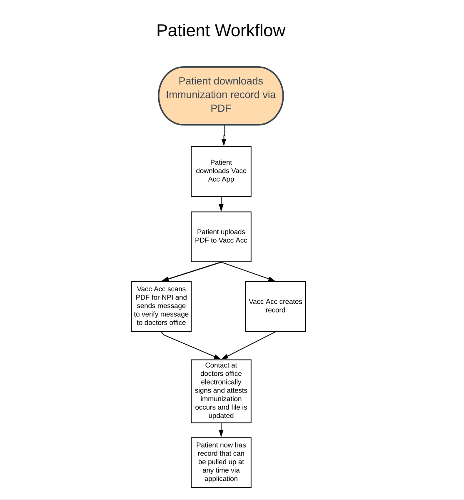
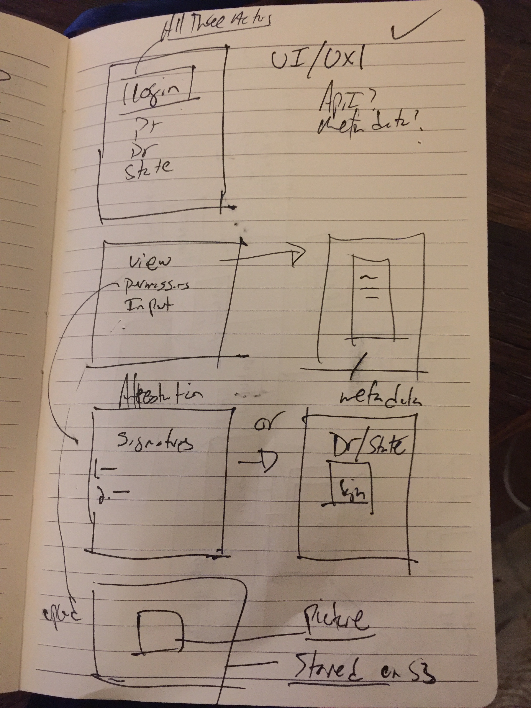
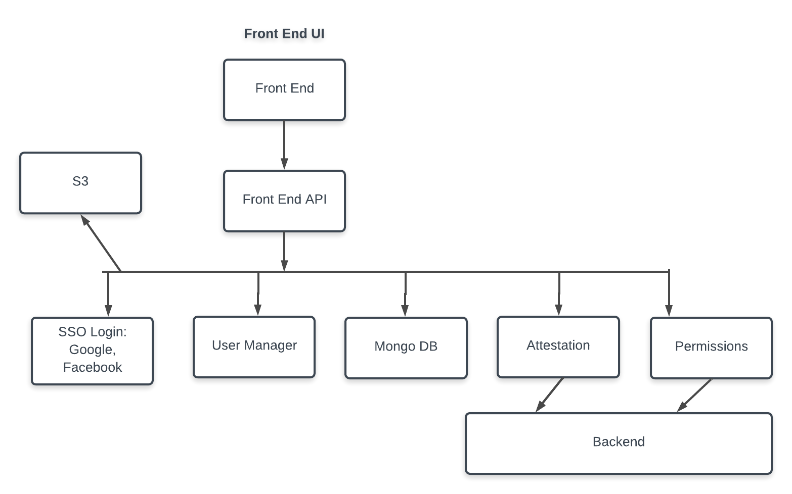

<link href="whitepaper-style.css" rel="stylesheet"></link>

# Decentralized Immunization EHR - DRAFT

**Index**:
1. [Web Domains](#web-domains)
2. [Problem Statement](#problem-statement)
3. [Design Statement](#design-statement)
4. [Use Case](#use-case)
5. [Initial Goal](#initial-goal)
6. [Paper Records](#paper-records)
7. [Electronic Records](#electronic-records)
8. [Competitive Advantages](#competitive-advantages)
9. [Patient Workflow](#patient-workflow)
10. [Technical Implementation](#technical-implementation-draft)
  a. [Front End Wireframes](#front-end-wireframes)
  b. [Back End Architecture](#back-end-architecture)
11. [Contributors](#contributors)

## Web Domains
**Website**: vacaccehr.squarespace.com
**Github**: https://github.com/tesla809/Vac-Acc-EHR/
**Email / Google Drive**: vaccaccehr@gmail.com
**Twitter**: https://twitter.com/vaccacc
**Slack**: http://bit.ly/StowProtocolSlack
and **join**: #decentralized-ehr

## Problem Statement:
Current solutions for patients to manage their individual health records in an electronic format, all rely on Health Record (EHR) companies such as Epic. These companies are focused on Hospital-to-Hospital transactions, offering only a ‘Patient Portal’ where patients can log in and access their health records, but cannot add any records or send them to another individual.

These EHRs fall short of providing patients with a means of providing quick, efficient access to their immunization records and do not satisfy verification concerns for border crossing and institutional access.

## Design Statement
How might we improve access to countries and services for **students** and **international travelers** so that they can access them by providing verified immunization records.

## Use Case
John Doe is a college student traveling abroad to Africa. He will need to provide proof of immunization against yellow fever in order to cross into Kenya and will also have to prove to school officials that he has had the seasonal flu vaccine.

John goes to a clinic and is given an injection providing him with immunity for yellow fever. In addition to storing his immunization record on the clinic’s EHR as well as being provided a folded paper certificate (International Certification of Vaccination) he asks that his record be faxed or emailed to the Vac – Acc EHR and an image be sent to them as well. The clinic does so, and presses “verified” on the confirmation email sent by Vac – Acc to verify that the doctor administered the yellow fever vaccine.

John loses his bag, which was carrying both his certificate of vaccination, on the flight. Once he arrives to Kenya, he’s unable to show them he’s already had the vaccine. He calls the clinic, but they’re unable to do anything other than send him a picture of his immunization record. He has no way of having a paper card arriving to him quickly enough. He can pull up his patient portal on his phone, but the border patrol is looking for the international certificate of vaccination.

John suddenly remembers that he has the Vac Acc EHR mobile app. He pulls up his phone, opens his app and pulls up the verified image of his international certificate of vaccination. The border patrol reviews the card, the electronically verified provider signature and confirms that the document is indeed valid.

However, while in Kenya, his immunity against typhoid expires. Luckily, his application notifies him that he will need a booster shot since Kenya has outbreaks of Typhoid. His doctor’s office would never be able to keep such meticulous tabs.

Once John is back, he has to prove he’s had his flu shot in order to be able to live in the college dorms. Instead of calling the doctor to fax his records to the student health services, he pulls up his application and shows them.

## Initial Goal
Our first iteration will be to create a Personal Health Record (PHR) mobile app that can be used to access a person's paper immunizations records along with providing a doctor's attestation on the Ethereum Blockchain using LinniaJS library.

Features (In order of importance):
- Physician Attestation
- Permission-based record sharing
- Record Encryption / Decryption

## Paper Records
**For paper records (PDFs of Immunization Records + the International Certificate of Vaccination)**

1. Patient / Provider Action - Send PDF files to team to digitize them and upload to MS Infrastructure
a. Immunization Records OR International Certificate of Vaccination
2. IPFS node support
3. Blockchain for authentication (Electronic we store pointer to centralized source such as EHR)

## Electronic Records
**For electronic records (stored on EHRs)**  
To add more information

## Competitive Advantages:
1. **Smart Contracts**: enables member institutions to develop important local applications that use their own data plus networked-derived intelligence.
2. **Unalterable Ledger**: Allows patient requests to be processed immediately rather than going through a protracted intermediary.
3. **Distributed Network**: Allows exchange of patient level data from multiple sources without compromising or unnecessarily duplicating records

## Patient Workflow
To add more information

## Technical Implementation- DRAFT
This is the initial technical under consideration. Have an idea, comment, concern? Please create an issue in our repo: https://github.com/tesla809/Vac-Acc-EHR/

### Front End Wireframes
To add formal wireframes and description

### Back End Architecture
To add formal wireframes and description

...

## Contributors
- [Nathan Boone](https://github.com/nathanboone)  
- [Anthony Albertorio](https://github.com/tesla809)
- [Doron Gutkind](https://github.com/dgutkind)
- [Idan Gutkind](https://github.com/idangutkind)  
- [Charles Okochu](https://github.com/ocobra)
- [Kuan Lin Huang](https://github.com/kuanlinhuang)  
- [Vutsal Singhal](https://github.com/vutsalsinghal)
- [Louell Sala](https://github.com/Alchemist21)
- [Dina Deljanin](https://github.com/dinadeljanin)
- [Rene Medalla](https://github.com/renegmed)
- Juan Carlos Calderon
- [Aliasgar Merchant](https://github.com/alijnmerchant21)    
- Hong Wang
- [Anurag Gandhi](https://github.com/anurag1604)  
- Abhi Ratnakumar   
- Tobi Olagunju
